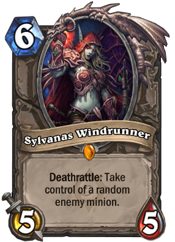
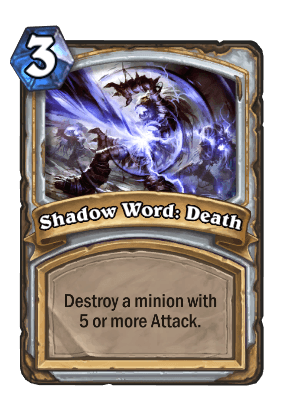

```{r setup, include=FALSE}
knitr::opts_chunk$set(echo = TRUE)
```

The following packages are used:

```{r libraries, message=FALSE}
library(dplyr)
library(ggplot2)
library(jsonlite)
library(knitr)
library(readr)
library(stringr)
library(tidyr)
library(zoo)
```


## Introduction

Hearthstone is a popular collectible card game published by Blizzard Entertainment in 2014, which is based on the Warcraft series by the same company. The goal of the game is to build a deck of 30 cards and win by getting the opponent's hero to 0 health or getting the opponent to concede first.

Cards can be classified according to the following categories:

* Class: Whether it can be used by only one, or many of the 9 classes in the game (Neutral)
* Rarity: Free, Common, Rare, Epic, Legendary
* Type: Minion, Spell, Weapon, Hero
* Set: Besides the Basic and Classic sets, additional cards are added to the game during expansions; the set also determines if it is eligible for Standard format.

### Datasets Used

There are three datasets:

* `data.csv` contains a list of decks submitted by players to [HearthPwn](www.hearthpwn.com) from 2013 (pre-launch) to 2017,
* `refs.json` contains detailed information about all cards (both collectible and non-collectible) up to March 2017.
    * These files are taken from the following Kaggle webpage: [History of Hearthstone](https://www.kaggle.com/romainvincent/history-of-hearthstone/home).
* `cards_collectible.json` contains detailed information about all the cards that are collectible in the game.
    * This file can be obtained from [HearthstoneJSON](https://hearthstonejson.com/docs/cards.html).

## Questions

1. Which are the most popular cards used in Ranked decks?
2. How many legendary cards do Ranked decks use on average?

### Breaking down the question

**Which are the most popular cards used in Ranked decks?**

We focus on the **Ranked** format where players get to decide which cards to include in their deck, therefore the cards' popularity are more accurately represented, and the gameplay is not subject to additional constraints that other game modes (like Tavern Brawls and Adventures) may impose.

**How do we determine popularity?**

We determine popularity by the number of decks that include *at least 1 copy* in the starting 30 cards (not generated by other effects). 

A deck can include **at most 2** copies of any card (1 for Legendary cards), thus a card's popularity is not heavily influenced by the number of copies players wish to use.

**Possible biases to consider**

Since Neutral cards can be used by multiple classes, they should be more popular than Class-specific cards.

For the Wild format, cards from the older sets may be more popular simply because they have been in the game longer.

For the Standard format, cards from the Basic and Classic sets will be more popular because they do not rotate out of the format unlike expansion cards.

### Why address such a question?

If a certain card becomes too popular (i.e. the community thinks players must include it in their decks), it reduces the card variety in the metagame and makes gameplay frustrating for other players (amongst other consequences). In the long term, this may lead to player attrition and loss of potential revenue (when players purchase card packs or other cosmetics).

Historically, Blizzard has dealt with problematic cards in one of several ways:

* Introduce new cards that work well against them
* [Adjust the card's mechanics](https://hearthstone.gamepedia.com/Card_changes) to weaken their power
* Shift a card into the [Hall of Fame](https://hearthstone.gamepedia.com/Hall_of_Fame) which removes it from Standard format.

## Loading the data

```{r load data, message=FALSE}
data_path <- file.path("..", "data")

decks_raw <- read_csv(file.path(data_path, "data.csv"))
cards_raw <- fromJSON(file.path(data_path, "cards_collectible.json"), flatten = TRUE)
```

### Decks data

The `decks_raw` data has `r nrow(decks_raw)` rows and `r ncol(decks_raw)` columns. The first 11 columns describe the deck's attributes (like date submitted, class, deck format) while the remaining 30 columns describe the cards each deck contains (based on the card's unique ID which can be referenced from the `cards_raw` data).

Detailed information on the variables can be found on the [Kaggle dataset](https://www.kaggle.com/romainvincent/history-of-hearthstone/home).

```{r}
names(decks_raw)
```

```{r eval=FALSE}
# code is not run
glimpse(decks_raw) 
```

There are `r sum(!complete.cases(decks_raw))` rows that contain missing data. The missing values are in the 10th column, which contains the decks' `title` as submitted by the users, so they can be safely ignored.

```{r}
sum(!complete.cases(decks_raw))
```

```{r}
which(is.na(decks_raw), arr.ind = TRUE)
```

### Cards data

Additional information on the variable can be found on [HearthstoneJSON](https://hearthstonejson.com/docs/cards.html).

There are two identifier fields for the cards: a character/string `id` and an integer `dbfId`. The `decks_raw` dataset uses the integer IDs to reference cards used.

```{r}
dim(cards_raw)
```

```{r include=FALSE}
names(cards_raw[1:32])
```

```{r eval=FALSE}
# code is not run
names(cards_raw)
```

```{r eval=FALSE}
# code is not run
glimpse(cards_raw)
```

The following computes the number of missing values in each field, with the exception of those that are present as lists or data frames (`mechanics`, `referencedTags`, `classes`, `entourage`) 

```{r eval=FALSE}
# code is not run
sapply(cards_raw, function(x) sum(is.na(x)))
```


## Pre-processing {.tabset #mislab}

### Decks data

<!-- 
Filter for decks submitted after game launch
Split decks into attribute and composition(cards) data frames
Define factor columns
Add year and month variables for decks
Relabel deck format
-->

The raw dataset is split into two, one containing the deck attributes and the other containing the deck composition (cards), with `deck_id` acting as the unique identifier. We also exclude decks created before launch (there were many card changes in the alpha and beta stages, making card popularity very volatile).

The `decks_comp` data will be pivoted to long format later on, thus excluding fields that are not related to the cards will minimize the size of the dataset.

```{r include=FALSE}
# check for duplicate deck ids
sum(duplicated(decks_raw$deck_id))
```

```{r split deck data}
launch_date <- as.Date("2014-03-11")

decks_attr <- decks_raw %>% 
    filter(date >= launch_date) %>% 
    select(deck_id, craft_cost:deck_format, deck_set:user)

decks_comp <- decks_raw %>% 
    filter(date >= launch_date) %>% 
    select(deck_id, card_0:card_29)
```

Within `decks_attr`, the factor/enumerated columns are identified and recast accordingly.

```{r decks_attr factor}
fct_cols_attr <- c("deck_archetype", "deck_class", "deck_format", "deck_set", "deck_type")

decks_attr[fct_cols_attr] <- lapply(decks_attr[fct_cols_attr], factor)
rm(fct_cols_attr)
```

#### Years and Months

While each deck has a submission `date`, we may also be interested in grouping the decks by month (which corresponds to Ranked seasons) and by year (which is marked by expansion release dates instead of calendar dates).

Years in the game based on a time period that: 

* Starts with the release of the first [card set](https://hearthstone.gamepedia.com/Card_set) of each year, which usually falls around April.
* Ends with the release of the first card set the next year (non-inclusive). 

So based on the release dates, the years would be:

* 2014-03-11 to 2015-04-01 (Live, Naxxramas, Goblin vs Gnomes)
* 2015-04-02 to 2016-04-25 (Blackrock, Grand Tournament, League of Explorers)
* 2016-04-26 to 2017-03-19 (Old Gods, Karazhan, Gadgetzan)

```{r decks_attr month and year}
# month (with year)
decks_attr$hsmonth <- as.yearmon(decks_attr$date)

# year (not by calendar)
decks_attr$hsyear <- case_when(
        decks_attr$date <= as.Date("2015-04-01") ~ "2014",
        decks_attr$date >= as.Date("2015-04-02") & 
            decks_attr$date <= as.Date("2016-04-25") ~ "2015",
        decks_attr$date >= as.Date("2016-04-26") ~ "2016"
    ) %>% 
        factor()
```

#### Deck Format

The Standard and Wild formats were formally introduced into the game on 2016-04-26 with the release of *Whispers of the Old Gods*; however the graphic below shows that many decks from June 2014 to April 2016 were marked as Wild. 

```{r deck format plot, echo=FALSE}
decks_attr %>% 
    filter(deck_type == "Ranked Deck") %>% 
    ggplot(aes(x = as.yearmon(date), fill = deck_format)) + 
    geom_bar() +
    scale_x_yearmon() +
    scale_fill_discrete(labels = c("Standard", "Wild")) +
    labs(title = "Ranked Decks in Standard and Wild formats",
         x = "Month",
         y = "Count",
         fill = "Format")
```

We can simply relabel all decks created before 2016-04-26 as Standard since all cards before then are not separated by format:

```{r}
decks_attr$deck_format[decks_attr$date < as.Date("2016-04-26")] <- "S"
```

```{r, include=FALSE}
# re-examine data after pre-processing
glimpse(decks_attr)
```

A summary of the processed data is shown below:

```{r echo=FALSE}
summary(decks_attr)
```

### Cards data
<!--
Select core columns
Relabel card sets
Convert uppercase columns to titlecase
Define factor columns
Identify mislabelled cards; create list for re-labelling
-->

Many columns in the `cards_raw` data pertain to the card's stats, mechanics and play requirements, which is better explained by the text on the card image. So we choose to only include the columns that we consider are core properties of the card (and not sufficiently explained by the card text):

```{r cards_simple}
cards_simple <- select(cards_raw,
                       dbfId,  name, cost,   cardClass, 
                       rarity, type,  set, collectible, id)
```

```{r, echo=FALSE}
glimpse(cards_simple)
```

The `set` column contains abbreviated names or nicknames and is not necessarily informative; we create a new column that uses the actual names of the card sets:

```{r}
unique(cards_simple$set)
```

```{r cards set}
# list for recoding card sets
cardset_lst <- list(
    "CORE" = "Basic",
    "EXPERT1" = "Classic",
    # 2014 sets
    "NAXX" = "Curse of Naxxramas",
    "GVG" = "Goblins vs Gnomes",
    # 2015 sets
    "BRM" = "Blackrock Mountain",
    "TGT" = "The Grand Tournament",
    "LOE" = "League of Explorers",
    # 2016 sets
    "OG" = "Whispers of the Old Gods",
    "KARA" = "One Night in Karazhan",
    "GANGS" = "Mean Streets of Gadgetzan",
    "HOF" = "Hall of Fame",
    # 2017 sets
    "UNGORO" = "Journey to Un'Goro",
    "ICECROWN" = "Knights of the Frozen Throne",
    "LOOTAPALOOZA" = "Kobolds & Catacombs",
    # 2018 sets
    "GILNEAS" = "The Witchwood",
    "BOOMSDAY" = "The Boomsday Project"
)

cards_simple$card_set <- recode(cards_simple$set, !!!cardset_lst,
                                .default = "Other")

# drop the set column to avoid confusion (it remains in the cards_raw dataset)
cards_simple$set <- NULL
# remove list (no longer needed)
rm(cardset_lst)
```

Some columns are entirely uppercase, which we convert to title case for readability:

```{r cards titlecase}
titlecase_cols <- c("cardClass", "rarity", "type")
cards_simple[titlecase_cols] <- lapply(cards_simple[titlecase_cols], 
                                       str_to_title)
rm(titlecase_cols)
```

The factor/enumerated columns are then identified and recast accordingly.

```{r cards factor}
fct_cols_cards <- c("cardClass", "rarity", "type", "card_set")

cards_simple[fct_cols_cards] <- lapply(cards_simple[fct_cols_cards], factor)
rm(fct_cols_cards)
```

A summary of the processed data is shown below:

```{r echo=FALSE}
summary(cards_simple)
```

### Mislabelled cards

As the decks are generated by human input, and there are multiple cards with the same name, it is recommended to check for cards that have the same name but wrong ID. 

Specifically, we are looking for the version of each card that is collectible (since all cards used in Ranked decks must be collectible). This step requires loading the full card data (which contains non-collectible cards).

```{r}
# IDs of all cards used
cards_used  <- decks_comp %>%
        select(card_0:card_29) %>%
        unlist(use.names = FALSE) %>%  # flatten into a vector
        unique() %>%
        sort()
```

```{r check missing ids}
# IDs of missing cards (using dbfId)
missing_cards <- cards_used[!cards_used %in% cards_simple$dbfId]

# how many cards are not found in the collectible cards dataset?
length(missing_cards)
```

```{r locate missing cards}
# data for all cards
cards_all_raw <- fromJSON(file.path(data_path, "refs.json"), flatten = TRUE)

# filter for those missing cards only
mssng_cards <- cards_all_raw %>% 
    select(dbfId, name, cardClass, type, collectible) %>% 
    filter(dbfId %in% missing_cards)
```

To find the correct IDs, we join them by name to the `cards_simple`. The `dbfID.x` on the left would be replaced by the `dbfID.y` on the right:

```{r}
mislabelled <- mssng_cards %>% 
    select(dbfId, name) %>% 
    # also drops uncollectible mislabelled cards (which are not in simple_cards)
    inner_join(cards_simple, by = "name") %>% 
    arrange(name)
mislabelled
```

We create a named list that can be used within `recode()`:

```{r}
# list values are correct ids
mislab_recode <- as.list(mislabelled$dbfId.y)
# list names are mislabelled ids
names(mislab_recode) <- mislabelled$dbfId.x
```

```{r clean up workspace, message=FALSE}
# intermediate objects no longer needed
rm(cards_used, missing_cards, cards_all_raw, mssng_cards)
```

### Other objects
<!--
class colours
release dates of card sets
-->

The following items are used for plotting:

```{r}
# class colours
class_colors <- c(
    "Druid" = "#FF7D0A",
    "Hunter" = "#228B22", #"#ABD473",
    "Mage" = "#40C7EB",
    "Paladin" = "#F58CBA",
    "Priest" = "#FFFFFF",
    "Rogue" = "#FFF569",
    "Shaman" = "#0070DE",
    "Warlock" = "#8787ED",
    "Warrior" = "#C79C6E",
    "Neutral" = "#777777"
)

# release dates of card sets
release_dates <- c(
    "Launch" = "2014-03-11", 
    "Naxxramas" = "2014-07-22", 
    "GvG" = "2014-12-08",
    "Blackrock" = "2015-04-02",
    "TGT" = "2015-08-24",
    "Explorers" = "2015-11-12",
    "Old Gods" = "2016-04-26",
    "Karazhan" = "2016-08-11",
    "Gadgetzan" = "2016-12-01"
)
```

## Popular Cards

The question we are trying to answer is

> Which are the most popular cards used in Ranked decks (Standard format)?

We measure card popularity by counting the number of decks that include at least one copy of that card.

### Preparation and Validation

To begin, we filter only for *Ranked Decks in Standard format*, pick out the variables of interest, join the decks to their compositions, and pivot the card columns.

```{r attr-comp join and pivot}
ranked_deck_cards <- decks_attr %>%
    filter(deck_type == "Ranked Deck",
           deck_format == "S") %>%
    select(deck_id, deck_class, 
           date, hsmonth, hsyear, 
           deck_format, deck_set, craft_cost) %>% 
    
    inner_join(decks_comp, by = "deck_id") %>% 
    gather(card_no, card_id, card_0:card_29) %>% 
    select(-card_no) %>% # drop the key column which is unnecessary
    
    # select unique combinations of deck and card (ignore duplicates)
    distinct(deck_id, card_id, .keep_all = TRUE)
```

```{r}
glimpse(ranked_deck_cards)
```


Before any further analysis, we want to check how many cards in this dataset are [mislabelled](#mislab):

```{r check missing cards}
sum(!(ranked_deck_cards$card_id) %in% cards_simple$dbfId)
```

We use the list `mislab_recode` to relabel those cards:

```{r relabel missing cards}
ranked_deck_cards$card_id <- recode(ranked_deck_cards$card_id, !!!mislab_recode)

# check again
sum(!(ranked_deck_cards$card_id) %in% cards_simple$dbfId)
```


### Popular Cards of All Time

To derive overall card popularity, we just count the number of times each `card_id` appears, then join it to the `cards_simple` data to retrieve the card details. After that, we can sort by number of decks:

```{r}
# create set of ranked standard decks for pct calculation
rs_decks_all <- decks_attr %>% 
    filter(deck_type == "Ranked Deck",
           deck_format == "S")
```

```{r pop cards all}
pop_cards_all <- ranked_deck_cards %>% 
    group_by(card_id) %>% 
    summarise(n_decks = n(),
              pct_all = n_decks * 100 / nrow(rs_decks_all)) %>% 
    inner_join(cards_simple, by = c("card_id" = "dbfId"))
```

As the table below shows, the most popular cards are expected to be **Neutral** class since they can be used by all nine classes in the game, as opposed to Class-specific cards:

```{r echo=FALSE}
pop_cards_all %>%
    select(name, cardClass, rarity, card_set, n_decks, pct_all) %>% 
    arrange(desc(n_decks)) %>% 
    slice(1:10) %>% 
    kable(digits = 1, caption = "Most Popular Cards (by number of decks)",
          col.names = c("Name", "Class", "Rarity", "Card Set", 
                        "No. of Decks", "% of All Decks"))
```

```{r include=FALSE}
# retrieve dbfids for images
pop_cards_all[order(pop_cards_all$n_decks, decreasing = T), ]$card_id[1:10]
```





```{r pop cards all plot, echo = FALSE}
pop_cards_all %>% 
    top_n(10, n_decks) %>% 
    mutate(name = reorder(name, n_decks, median)) %>% 
    
    ggplot(aes(x = name, y = n_decks)) +
    geom_bar(stat = "identity") +
    coord_flip(expand = FALSE, ylim = c(0, 63000), xlim = c(0.4, 10.6)) +
    labs(title = "Most Popular Cards", 
         x = "", y = "No. of Decks") +
    theme(legend.position = "none", 
          panel.spacing = unit(1, "points"),
          panel.grid.major.y = element_blank(), 
          plot.title = element_text(size = 16),
          axis.text.y = element_text(size = 9),
          panel.background = element_rect(fill = "#C3C3C3"))
```

Note that the Hall of Fame was only created in April 2017; the popularity of those three cards (Azure Drake, Sylvanas Windrunner, Ragnaros the Firelord) may have been one of the factors behind Blizzard's decision to move them out of Standard format and into the Hall of Fame.

### Popular Class-Specific Cards

So we can follow up by asking:

> Amongst class-specific cards, which is the most popular card for each class?

By tallying the total number of decks by class, we can later evaluate for each class, the percentage of decks which use the most popular class-specific cards. After filtering out the Neutral cards, we can look for the most popular class-specific cards:

```{r decks class, echo=FALSE}
rs_decks_class <- rs_decks_all %>% 
    group_by(deck_class) %>% 
    summarise(tot_decks_class = n())
```

The most popular class-specific cards are as follows:

```{r pop cards class, warning=FALSE}
pop_cards_class <- pop_cards_all %>% 
    filter(!is.na(cardClass), cardClass != "Neutral") %>% 
    select(cardClass, name, rarity, card_set, n_decks) %>% 
    inner_join(rs_decks_class, by = c("cardClass" = "deck_class")) %>% 
    mutate(pct_class = n_decks * 100 / tot_decks_class)
```

```{r echo=FALSE, warning=FALSE}
pop_cards_class %>% 
    group_by(cardClass) %>%
    top_n(1, n_decks) %>% 
    ungroup() %>% 
    arrange(cardClass, desc(n_decks)) %>% 
    kable(digits = 1, caption = "Most Popular Class-Specific Cards",
          col.names = c("Class", "Name", "Rarity", "Card Set", 
                        "No. of Decks", "Total No. of Class Decks", "% of Class Decks"))
```

```{r include=FALSE}
# retrieve dbfids for images
pop_cards_all %>% 
    filter(!is.na(cardClass), cardClass != "Neutral") %>% 
    group_by(cardClass) %>% 
    top_n(1, n_decks) %>% 
    arrange(cardClass, desc(n_decks)) %>% 
    `$`(card_id)
```





While Frostbolt appeared in the largest number of decks, many of the most popular cards were included in more than 90% of decks from their class. The only exception would be Power Overwhelimg (Warlock) which only appeared in 63% of Warlock decks.

As the table shows, cards from the **Basic** and **Classic** sets tend to be more popular because they do not rotate out of Standard format, and they have been around since the launch of Hearthstone.

The following plot shows the relative popularity of the top 3 cards for each class. Dashed lines indicate the total number of decks representing each class in the dataset:

```{r pop cards class plot, echo=FALSE, fig.height=7, message=FALSE}
pop_cards_class %>% 
    group_by(cardClass) %>% 
    top_n(3, n_decks) %>% 
    ungroup() %>%  # ungroup is required before reordering chars/factors
    mutate(name = reorder(name, n_decks, median)) %>% 
    
    ggplot(aes(x = name, y = n_decks, fill = cardClass)) +
    geom_bar(stat = "identity") +
    geom_hline(aes(yintercept = tot_decks_class), linetype = 2) +
    scale_fill_manual(values = class_colors) +
    coord_flip(expand = FALSE, xlim = c(0.4, 3.6),
               ylim = c(0, max(pop_cards_class$tot_decks_class) + 1000)) +
    facet_wrap(vars(cardClass), ncol = 1, scales = "free_y", strip.position = "right") +
    labs(title = "Most Popular Class-Specific Cards in Ranked Standard Decks", 
         x = "", y = "No. of Decks") +
    theme(legend.position = "none", 
          panel.spacing = unit(1, "points"),
          panel.grid.major.y = element_blank(), 
          plot.title = element_text(size = 12),
          axis.text.y = element_text(size = 9),
          panel.background = element_rect(fill = "#C3C3C3"))
```

### Popular Cards by Year

Our `decks_attr` data spans 3 years from March 2014 to March 2017. Recall that years are defined by release dates of card sets instead of calendar months:

* 2014-03-11 to 2015-04-01 (Live, Naxxramas, Goblin vs Gnomes)
* 2015-04-02 to 2016-04-25 (Blackrock, Grand Tournament, League of Explorers)
* 2016-04-26 to 2017-03-19 (Old Gods, Karazhan, Gadgetzan)

To derive card popularity, we count the number of times each `card_id` appears in each `hsyear`:

```{r decks year}
rs_decks_year <- rs_decks_all %>% 
    group_by(hsyear) %>% 
    summarise(tot_decks_year = n())
```

```{r pop cards year}
pop_cards_year <- ranked_deck_cards %>% 
    group_by(hsyear, card_id) %>% 
    summarise(n_decks = n()) %>% 
    inner_join(cards_simple, by = c("card_id" = "dbfId"))
```

```{r, echo=FALSE, results='asis'}
pop_cards_year %>% 
    select(hsyear, name, cardClass, rarity, card_set, n_decks) %>% 
    group_by(hsyear) %>% 
    top_n(3, n_decks) %>% 
    ungroup() %>% 
    inner_join(rs_decks_year, by = "hsyear") %>% 
    mutate(pct_year = n_decks * 100 / tot_decks_year) %>% 
    arrange(hsyear, desc(n_decks)) %>% 
    kable(digits = 1, caption = "Top 3 Cards in the Years 2014, 2015, 2016",
          col.names = c("Year", "Name", "Class", "Rarity", "Card Set",
                        "No. of Decks", "Total No. of Decks in Year", "% of Decks in Year"))
```

### Popular Cards by Month

On the other hand, the Ranked ladder resets to mark a new Season at the start of every calendar month. Players take this opportunity to improve upon their previous ranking, and they may try to include new cards to overcome the popular decks that they tend to encounter.

```{r echo=FALSE}
decks_attr %>% 
    filter(deck_type == "Ranked Deck", 
           deck_format == "S") %>% 
    ggplot(aes(x = hsmonth)) +
    geom_bar(stat = "count") +
    scale_x_yearmon() +
    geom_vline(xintercept = as.yearmon(release_dates), alpha = 0.2) +
    annotate("text", label = names(release_dates), 
             x = as.yearmon(release_dates), y = 16000,
             hjust = 1, angle = 60) +
    labs(title = "Standard Ranked Decks Submitted Every Month",
         x = "Month", y = "")
```

From the graph above, there is usually a spike in the number of decks submitted when a new card set is released (marked with dark lines), which gradually tapers off until the next card set is released.

A possible question to ask may be:

> Are there any shifts in card popularity in the three months following the release of the Old Gods card set (2016-04-26)?

Looking at the number of decks submitted every day for the first three months following 26th April in the plot below, the number of decks submitted (and therefore the number of cards included) sharply tapers off after the first week. 

```{r month plot, echo=FALSE}
decks_attr %>% 
    filter(date >= as.Date("2016-04-26"),
           date <= as.Date("2016-07-25"),
           deck_type == "Ranked Deck",
           deck_format == "S") %>% 
    ggplot(aes(x = date)) +
    geom_bar() +
    scale_x_date(date_breaks = "1 month",
                 date_minor_breaks = "1 week") +
    labs(title = "Number of Decks", x = "Date", y = "")
```


```{r pop cards month}
pop_cards_2016_aprjul <- ranked_deck_cards %>%
    filter(date >= as.Date("2016-04-26"),
           date <= as.Date("2016-07-25")) %>% 
    group_by(hsmonth, card_id) %>% 
    summarise(n_decks = n()) %>% 
    inner_join(cards_simple, by = c("card_id" = "dbfId"))
```

```{r decks month, echo=FALSE}
rs_decks_2016_aprjul <- rs_decks_all %>% 
    filter(date >= as.Date("2016-04-26"),
           date <= as.Date("2016-07-25")) %>% 
    group_by(hsmonth) %>% 
    summarise(tot_decks_month = n())
```


Interestingly enough, while cards from the latest card set were popular in the first week (still in April), older cards returned to the top spots in subsequent months:

```{r echo=FALSE, results='asis'}
pop_cards_2016_aprjul %>% 
    select(hsmonth, name, rarity, card_set, n_decks) %>% 
    group_by(hsmonth) %>% 
    top_n(5, n_decks) %>% 
    inner_join(rs_decks_2016_aprjul, by = "hsmonth") %>% 
    mutate(pct_month = n_decks * 100 / tot_decks_month) %>% 
    arrange(hsmonth, desc(n_decks)) %>% 
    kable(digits = 1, caption = "Popular Cards in Apr-Jul 2016 following Old Gods release",
          col.names = c("Month", "Name", "Rarity", "Card Set", "No. of Decks", 
                        "Total No. of Decks in Month", "% of Decks in Month"))
```


### Popular Cards by Card Set

> Which were the most popular cards (Neutral and Class-specific) for each card set?

```{r pop cards set, echo=FALSE, results='asis'}
pop_cards_all %>% 
    filter(cardClass == "Neutral") %>% 
    group_by(card_set) %>% 
    top_n(3, n_decks) %>% 
    arrange(card_set, desc(n_decks)) %>% 
    select(card_set, name, rarity, n_decks) %>% 
    kable(caption = "Most Popular Neutral Cards by Card Set",
          col.names = c("Card Set", "Name", "Rarity", "No. of Decks"))
```

```{r pop cards set class, echo=FALSE, results='asis'}
pop_cards_all %>% 
    filter(cardClass != "Neutral") %>% 
    group_by(card_set) %>% 
    top_n(3, n_decks) %>% 
    arrange(card_set, desc(n_decks)) %>% 
    select(card_set, name, cardClass, n_decks) %>% 
    kable(caption = "Most Popular Class Cards by Card Set",
          col.names = c("Card Set", "Name", "Class", "No. of Decks"))
```

### Cards by Mana Cost

> Between 1 and 10-cost mana cards, which cards were the most popular amongst cards of the same cost?

## Legendary Cards