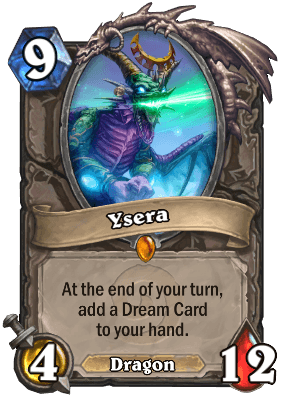

```{r setup, include=FALSE}
knitr::opts_chunk$set(echo = FALSE)
```


```{r libraries, message=FALSE}
library(dplyr)
library(ggplot2)
library(jsonlite)
library(knitr)
library(readr)
library(stringr)
library(tidyr)
library(zoo)
```


## Introduction

Hearthstone is a popular collectible card game published by Blizzard Entertainment in 2014, which is based on the Warcraft series by the same company. The goal of the game is to build a deck of 30 cards and defeat the opponent who also has a deck of 30 cards.

In Hearthstone, cards can be classified according to the following categories:

* **Class**: Neutral cards can be used by all nine classes, while Class cards can only be used by the indicated class.
* **Rarity**: How often cards can be found when opening card packs.
    * Cards are indicated as Free, Common, Rare, Epic and Legendary, ordered by increasing rarity.
* **Type**: Different types of cards have different effects in the game:
    * Minions are played on the game board and can attack Heroes or other minions.
    * Spells are Class abilities that generate a variety of effects on the board.
    * Weapons are items that Heroes can equip to attack Heroes or other minions.
    * Heroes represent the player; the player loses when the Hero's health reaches 0.
* **Set**: Cards are released in designated sets, which are usually based on a certain theme in the Warcraft universe.
    * The core game consists of two sets, Basic and Classic, which are always available in the game.
    * Expansion sets add newer cards to the game, and are released at regular intervals

### Approaching the question

> Which are the most popular cards used in Ranked decks?

**Which are the most popular cards used in Ranked decks?**

We focus on the **Ranked** format where players get to decide which cards to include in their deck, therefore the cards' popularity are more accurately represented, and the gameplay is not subject to additional constraints that other game modes (like Tavern Brawls and Adventures) may impose.

**How do we determine popularity?**

We determine popularity by the number of decks that include *at least 1 copy* in the starting 30 cards (not generated by other effects). 

A deck can include **at most 2** copies of any card (1 for Legendary cards), thus a card's popularity is not heavily influenced by the number of copies players wish to use.

**Possible biases to consider**

* Decks and cards presented in this data may **not** necessarily be used by players in the game itself. However, without the means to track actual matches being played in the game itself, we instead use the list of decks submitted by players as an **approximation** of the decks and cards often used by the playerbase.

* Since **Neutral** cards can be used by multiple classes, they should be more popular than **Class** cards.

* For the Wild format, cards from the older sets may be more popular simply because they have been in the game longer.

* For the Standard format, cards from the **Basic** and **Classic** sets will be more popular because they do not rotate out of the format unlike expansion cards.


### Why address such a question?

If a certain card becomes too popular (i.e. the community thinks players must include it in their decks), it reduces the card variety in the metagame and makes gameplay frustrating for other players (amongst other consequences). In the long term, this may lead to player attrition and loss of potential revenue (when players purchase card packs or other cosmetics).

Historically, Blizzard has dealt with problematic cards in one of several ways:

* Introduce new cards that work well against them
* [Adjust the card's mechanics](https://hearthstone.gamepedia.com/Card_changes) to weaken their power
* Shift a card into the [Hall of Fame](https://hearthstone.gamepedia.com/Hall_of_Fame) which removes it from Standard format.

## Dataset Overview

We will use three datasets in this analysis:

* `data.csv` contains a list of decks submitted by players to [HearthPwn](www.hearthpwn.com) from 2013 (pre-launch) to 2017.
    * Obtained from [Kaggle: History of Hearthstone](https://www.kaggle.com/romainvincent/history-of-hearthstone/home)
* `refs.json` contains detailed information about all cards (**collectible** and **non-collectible**) up to March 2017.
    * Obtained from [Kaggle: History of Hearthstone](https://www.kaggle.com/romainvincent/history-of-hearthstone/home)
* `cards_collectible.json` contains detailed information about the cards that are **collectible** in the game (up to August 2018)
    * Obtained from [HearthstoneJSON](https://hearthstonejson.com/docs/cards.html).

```{r load data, message=FALSE}
data_path <- file.path("..", "data")

# data for decks
decks_raw <- read_csv(file.path(data_path, "data.csv"))
# data for collectible cards
cards_raw <- tbl_df(fromJSON(file.path(data_path, "cards_collectible.json"), flatten = TRUE))
# data for all cards
cards_all_raw <- fromJSON(file.path(data_path, "refs.json"), flatten = TRUE)
```

### Decks data

The first few rows and columns of the raw data `decks_raw` is shown below:

```{r}
head(decks_raw[1:10], 6)
```

The `decks_raw` data has `r nrow(decks_raw)` rows and `r ncol(decks_raw)` columns. The columns `craft_cost` to `user` describe the deck's attributes (like date submitted, class, deck format) while the columns `card_0` to `card_29` describe the cards using their card IDs. Detailed information on the variables can be found on the [Kaggle: History of Hearthstone](https://www.kaggle.com/romainvincent/history-of-hearthstone/home).

```{r}
names(decks_raw)
```


There are `r sum(!complete.cases(decks_raw))` rows that contain missing data. All the missing values are in the `title` column, so they can be safely ignored.

```{r eval=FALSE}
which(is.na(decks_raw), arr.ind = TRUE)
```

```{r}
decks_raw[!complete.cases(decks_raw), 2:10]
```


### Collectible Cards data

The first few rows and columns of the `cards_raw` data is shown below (some columns are shown truncated):

```{r}
col_trunc <- function(col, width, side = c("right", "left", "center"), 
                      ellipsis = "..."){
    if (class(col) == "character"){
        col <- str_trunc(col, width, side, ellipsis)
        return(col)
    } else {
        return(col)
    }
}

cards_raw[1:12] %>% 
    lapply(col_trunc, width = 10, side = "right") %>%
    as_tibble() %>% 
    head()
```

This dataset has `r nrow(cards_raw)` rows and `r ncol(cards_raw)` columns. The first 32 columns `artist` to `questReward` describe the characteristics of each card.


```{r}
names(cards_raw)[1:32]
```

Some of the characteristics, including `name`, Mana `cost`, `race`, `health` and `text`, can also been seen on the card itself. Some of the `mechanics` are also highlighted in **bold**:


```{r include=FALSE, eval=FALSE}
glimpse(cards_raw[cards_raw$dbfId == 825, 1:18])
```

The remaining columns are in fact nested under the `playRequirements` field, which specifies how certain cards can only be played in the game. These requirements are also implicitly/explicitly stated in the card text. (Column names are shown truncated)

```{r}
names(cards_raw)[33:65] %>% 
    str_trunc(25, "left")
```

The following card, based on its text, would require certain conditions to be played (a minion on the board, that has not taken any damage):


```{r include=FALSE, eval=FALSE}
glimpse(cards_raw[cards_raw$dbfId == 180, 33:65])
```

Additional information on the variables can be found on [HearthstoneJSON](https://hearthstonejson.com/docs/cards.html).

Each card has two unique identifiers: a character/string `id` and an **integer `dbfId`**. The integer `dbfId` is used across both the deck and card datasets, which can be joined later. 


## Pre-processing 

The following steps were involved in pre-processing the raw data:

### Decks dataset

* Split the raw data into an **deck attribute** table containing the decks' properties, and a **deck composition** table containing the decks' card IDs, which are joined by `deck_id`.
* Exclude decks created before the game launch date (2014-03-11), due to the game undergoing significant changes in the testing phases.
* Convert categorical variables from character to **factor** type.
* Add a `hsyear` variable that categorizes deck submissions into year-long periods that determine which Hearthstone card sets are eligible for Standard format play. 
    * These periods are not based on the calendar year, each `hsyear` begins with the release of the first expansion card set in that calendar year.
* Add a `hsmonth` variable, based on calendar months, categorizing deck submissions into month-long Ranked Seasons. Rankings are reset at the start of each season, giving players opportunities to try out new decks and improve on their previous ranking.
* For the `deck_format` column, relabel all decks submitted before 2016-04-26 as "Standard". 
    * Prior to this date, all collectible cards were playable in Ranked games. From the game year 2016 onwards, the game introduced the **S**tandard format (restricted to cards from the Basic and Classic sets, and the last 2 calendar years) and the **W**ild format (all cards).


```{r split deck data}
launch_date <- as.Date("2014-03-11")

decks_attr <- decks_raw %>% 
    filter(date >= launch_date) %>% 
    select(deck_id, craft_cost:deck_format, deck_set:user)

decks_comp <- decks_raw %>% 
    filter(date >= launch_date) %>% 
    select(deck_id, card_0:card_29)
```

```{r decks_attr factor}
fct_cols_attr <- c("deck_archetype", "deck_class", "deck_format", "deck_set", "deck_type")

decks_attr[fct_cols_attr] <- lapply(decks_attr[fct_cols_attr], factor)
rm(fct_cols_attr)
```


```{r decks_attr month and year}
# month (with year)
decks_attr$hsmonth <- as.yearmon(decks_attr$date)

# year (not by calendar)
decks_attr$hsyear <- case_when(
        decks_attr$date <= as.Date("2015-04-01") ~ "2014",
        decks_attr$date >= as.Date("2015-04-02") & 
            decks_attr$date <= as.Date("2016-04-25") ~ "2015",
        decks_attr$date >= as.Date("2016-04-26") ~ "2016"
    ) %>% 
        factor()
```


```{r relabel deck format}
decks_attr$deck_format[decks_attr$date < as.Date("2016-04-26")] <- "S"
```

A summary of the processed deck attribute data `decks_attr` is shown below:

```{r echo=FALSE}
summary(decks_attr)
```

### Cards dataset

* Select columns containing attributes that are important for the analysis: this includes the name, ID(s), class, rarity, type and card set.
* Relabel the values in the `set` column with the actual names of the card sets.
* Convert columns that are entirely in UPPERCASE to Title Case for readability
* Convert categorical variables from character to **factor** type.

```{r cards_simple}
cards_simple <- select(cards_raw,
                       dbfId,  name, cost,   cardClass, 
                       rarity, type,  set, collectible, id)
```

<!-- The `set` column contains abbreviated names or nicknames and is not necessarily informative; we create a new column that uses the actual names of the card sets: -->

```{r cards set}
# list for recoding card sets
cardset_lst <- list(
    "CORE" = "Basic",
    "EXPERT1" = "Classic",
    # 2014 sets
    "NAXX" = "Curse of Naxxramas",
    "GVG" = "Goblins vs Gnomes",
    # 2015 sets
    "BRM" = "Blackrock Mountain",
    "TGT" = "The Grand Tournament",
    "LOE" = "League of Explorers",
    # 2016 sets
    "OG" = "Whispers of the Old Gods",
    "KARA" = "One Night in Karazhan",
    "GANGS" = "Mean Streets of Gadgetzan",
    "HOF" = "Hall of Fame",
    # 2017 sets
    "UNGORO" = "Journey to Un'Goro",
    "ICECROWN" = "Knights of the Frozen Throne",
    "LOOTAPALOOZA" = "Kobolds & Catacombs",
    # 2018 sets
    "GILNEAS" = "The Witchwood",
    "BOOMSDAY" = "The Boomsday Project"
)

cards_simple$card_set <- recode(cards_simple$set, !!!cardset_lst,
                                .default = "Other")

# drop the set column to avoid confusion (it remains in the cards_raw dataset)
cards_simple$set <- NULL
# remove list (no longer needed)
rm(cardset_lst)
```

<!-- Some columns are entirely uppercase, which we convert to title case for readability: -->

```{r cards titlecase}
titlecase_cols <- c("cardClass", "rarity", "type")
cards_simple[titlecase_cols] <- lapply(cards_simple[titlecase_cols], 
                                       str_to_title)
rm(titlecase_cols)
```

The factor/enumerated columns are then identified and recast accordingly.

```{r cards factor}
fct_cols_cards <- c("cardClass", "rarity", "type", "card_set")

cards_simple[fct_cols_cards] <- lapply(cards_simple[fct_cols_cards], factor)
rm(fct_cols_cards)
```

A summary of the processed collectible card data `cards_simple` is shown below:

```{r echo=FALSE}
summary(cards_simple)
```

### Mislabelled cards 

Card IDs in the processed decks data may be incorrect, due to the following reasons:

* Deck submissions are generated by user input.
* Users choose cards based on card names, not card IDs.
* However, there are cards that share the same name, but have different IDs.
    * Amongst each set of replicates, only one is collectible in-game.
    
Therefore, we would like to relabel any card IDs that point to non-collectible cards with the respective IDs that point to the collectible version with the same name.

The following steps were taken:

* From the table containing deck compositions (cards), we compile a list of unique IDs that appear in all the decks in our dataset.
* Filter out the IDs that is *not* found in our collectible cards data `cards_simple`.
* Using the raw data for all cards `cards_all_raw`, filter out the cards matching the above IDs.
* Join this table back to the `cards_simple` data, based on same `name`s. 


<!-- As the decks are generated by human input, and there are multiple cards with the same name, it is recommended to check for cards that have the same name but wrong ID.  -->

<!-- Specifically, we are looking for the version of each card that is collectible (since all cards used in Ranked decks must be collectible). This step requires loading the full card data (which contains non-collectible cards). -->

```{r}
# IDs of all cards used
cards_used  <- decks_comp %>%
        select(card_0:card_29) %>%
        unlist(use.names = FALSE) %>%  # flatten into a vector
        unique() %>%
        sort()
```

```{r check missing ids}
# IDs of missing cards (using dbfId)
missing_cards <- cards_used[!cards_used %in% cards_simple$dbfId]
```

```{r locate missing cards}
# filter for those missing cards only
mssng_cards <- cards_all_raw %>% 
    select(dbfId, name, cardClass, type, collectible) %>% 
    filter(dbfId %in% missing_cards)
```

The `dbfID.x` on the left would be replaced by the `dbfID.y` on the right:

```{r}
mislabelled <- mssng_cards %>% 
    select(dbfId, name) %>% 
    # also drops uncollectible mislabelled cards (which are not in simple_cards)
    inner_join(cards_simple, by = "name") %>% 
    arrange(name)
head(mislabelled)
```

To facilitate relabeling, we create a list of key-values that associate each `dbfID.x` with the corresponding `dbfID.y`, which can be used in conjunction with the function `recode()` that replaces character values by name.

```{r}
# list values are correct ids
mislab_recode <- as.list(mislabelled$dbfId.y)
# list names are mislabelled ids
names(mislab_recode) <- mislabelled$dbfId.x
```

```{r}
# relabel ids in data
decks_comp <- decks_comp %>% 
    mutate_at(vars(starts_with("card")), recode, !!!mislab_recode)
```

```{r clean up workspace, message=FALSE}
# intermediate objects no longer needed
rm(cards_used, missing_cards, cards_all_raw, mssng_cards)
```

<!--
The following items may be used for plotting:
class colours
rarity colours
release dates of card sets
-->

```{r other objects}
# class colours
class_colors <- c(
    "Druid" = "#FF7D0A",
    "Hunter" = "#228B22", #"#ABD473",
    "Mage" = "#40C7EB",
    "Paladin" = "#F58CBA",
    "Priest" = "#FFFFFF",
    "Rogue" = "#FFF569",
    "Shaman" = "#0070DE",
    "Warlock" = "#8787ED",
    "Warrior" = "#C79C6E",
    "Neutral" = "#777777"
)

# rarity colours
rarity_colors <- c(
    "Free" = NA,
    "Common" = "#000000",
    "Rare" = "#1E90FF",
    "Epic" = "#9932CC",
    "Legendary" = "#FFB90F"
)

# release dates of card sets
release_dates <- c(
    "Launch" = "2014-03-11", 
    "Naxxramas" = "2014-07-22", 
    "GvG" = "2014-12-08",
    "Blackrock" = "2015-04-02",
    "TGT" = "2015-08-24",
    "Explorers" = "2015-11-12",
    "Old Gods" = "2016-04-26",
    "Karazhan" = "2016-08-11",
    "Gadgetzan" = "2016-12-01"
)

# darker plot theme for this doc
theme_doc <- theme(panel.spacing = unit(1, "points"),
                   panel.grid.major.y = element_blank(), 
                   plot.title = element_text(size = 12),
                   axis.text.y = element_text(size = 9),
                   panel.background = element_rect(fill = "#C3C3C3"))
```

## Analysis of Popular Cards

The question we are trying to answer is

> Which are the most popular cards used in Ranked decks (Standard format)?

We measure card popularity by counting the number of decks that include at least one copy of that card.

### Preparation and Validation

To begin, we filter only for *Ranked Decks in Standard format*, pick out the variables of interest, join the decks to their compositions, and pivot the card columns.

```{r attr-comp join and pivot}
ranked_deck_cards <- decks_attr %>%
    filter(deck_type == "Ranked Deck",
           deck_format == "S") %>%
    select(deck_id, deck_class, 
           date, hsmonth, hsyear, 
           deck_format, deck_set, craft_cost) %>% 
    
    inner_join(decks_comp, by = "deck_id") %>% 
    gather(card_no, card_id, card_0:card_29) %>% 
    select(-card_no) %>% # drop the key column which is unnecessary
    
    # select unique combinations of deck and card (ignore duplicates)
    distinct(deck_id, card_id, .keep_all = TRUE)
```

```{r}
glimpse(ranked_deck_cards)
```


Before any further analysis, we want to check how many cards in this dataset are [mislabelled](#mislab):

```{r check missing cards}
sum(!(ranked_deck_cards$card_id) %in% cards_simple$dbfId)
```

We use the list `mislab_recode` to relabel those cards:

```{r relabel missing cards}
ranked_deck_cards$card_id <- recode(ranked_deck_cards$card_id, !!!mislab_recode)

# check again
sum(!(ranked_deck_cards$card_id) %in% cards_simple$dbfId)
```


### Popular Cards of All Time

To derive overall card popularity, we just count the number of times each `card_id` appears, then join it to the `cards_simple` data to retrieve the card details. After that, we can sort by number of decks:

```{r}
# create set of ranked standard decks for pct calculation
rs_decks_all <- decks_attr %>% 
    filter(deck_type == "Ranked Deck",
           deck_format == "S")
```

```{r pop cards all}
pop_cards_all <- ranked_deck_cards %>% 
    group_by(card_id) %>% 
    summarise(n_decks = n(),
              pct_all = n_decks * 100 / nrow(rs_decks_all)) %>% 
    inner_join(cards_simple, by = c("card_id" = "dbfId"))
```

As the table below shows, the most popular cards are expected to be **Neutral** class since they can be used by all nine classes in the game, as opposed to Class-specific cards:

```{r echo=FALSE}
pop_cards_all %>%
    select(name, cardClass, rarity, card_set, n_decks, pct_all) %>% 
    arrange(desc(n_decks)) %>% 
    slice(1:10) %>% 
    kable(digits = 1, caption = "Most Popular Cards (by number of decks)",
          col.names = c("Name", "Class", "Rarity", "Card Set", 
                        "No. of Decks", "% of All Decks"))
```

```{r include=FALSE, eval=FALSE}
# retrieve dbfids for images
pop_cards_all[order(pop_cards_all$n_decks, decreasing = T), ]$card_id[1:10]
```


**Which abilities/properties makes these cards popular?**

* *Card draw* - Having more cards in hand gives the player more options to try and get an advantage over the opponent.
* *Deathrattle* - Triggers desirable effects when the minion is killed.
* *Enhancement* - Improving the player's other cards on the board/in hand.
* *Taunt* - Protects the hero and minions from attack damage.

As the Hall of Fame was only created in April 2017; the popularity of those three cards (Azure Drake, Sylvanas Windrunner, Ragnaros the Firelord) may have been one of the factors behind Blizzard's decision to move them out of Standard format and into the Hall of Fame.

The plot below shows the relative popularity of all cards in the dataset:

```{r pop cards all plot, echo = FALSE, fig.height=4}
pop_cards_all %>% 
    top_n(10, n_decks) %>% 
    mutate(name = reorder(name, n_decks, median)) %>% 
    
    ggplot(aes(x = name, y = n_decks)) +
    geom_bar(stat = "identity") +
    geom_point(aes(color = rarity, y = 0), shape = 18, size = 3) +
    scale_colour_manual(values = rarity_colors) +
    coord_flip(expand = FALSE, ylim = c(-1000, 63000), xlim = c(0.4, 10.6)) +
    labs(title = "Most Popular Cards", 
         x = "", y = "No. of Decks", color = "Card Rarity") +
    theme_doc +
    theme(legend.position = "bottom")
```

### Popular Class-Specific Cards

So we can follow up by asking:

> Amongst class-specific cards, which is the most popular card for each class?

By tallying the total number of decks by class, we can later evaluate for each class, the percentage of decks which use the most popular class-specific cards. After filtering out the Neutral cards, we can look for the most popular class-specific cards:

```{r decks class}
rs_decks_class <- rs_decks_all %>% 
    group_by(deck_class) %>% 
    summarise(tot_decks_class = n())
```

```{r pop cards class, warning=FALSE}
pop_cards_class <- pop_cards_all %>% 
    filter(!is.na(cardClass), cardClass != "Neutral") %>% 
    select(cardClass, name, rarity, card_set, n_decks) %>% 
    inner_join(rs_decks_class, by = c("cardClass" = "deck_class")) %>% 
    mutate(pct_class = n_decks * 100 / tot_decks_class)
```

The most popular class-specific cards are as follows:

```{r echo=FALSE, warning=FALSE}
pop_cards_class %>% 
    group_by(cardClass) %>%
    top_n(1, n_decks) %>% 
    ungroup() %>% 
    arrange(cardClass, desc(n_decks)) %>% 
    kable(digits = 1, caption = "Most Popular Class-Specific Cards",
          col.names = c("Class", "Name", "Rarity", "Card Set", 
                        "No. of Decks", "Total No. of Class Decks", "% of Class Decks"))
```

```{r include=FALSE, eval=FALSE}
# retrieve dbfids for images
pop_cards_all %>% 
    filter(!is.na(cardClass), cardClass != "Neutral") %>% 
    group_by(cardClass) %>% 
    top_n(1, n_decks) %>% 
    ungroup() %>% 
    arrange(cardClass, desc(n_decks)) %>% 
    select(name, card_id)
```


**Which abilities/properties makes the above cards popular?**

* *Targeted damage* - Being able to remove problematic minions that are otherwise protected by Taunt, or when your own minions do not have the damage to kill it.
* *Transformation/removal* - Alternatively, simply removing such minions from the board might be more feasible.
* *Weapons* - Most minions cannot attack the turn they are played, but weapons enable the player to attack immediately.

Some of the other popular cards (in the following plot) also have effects like *card draw* or *area of effect*.

While Frostbolt appeared in the largest number of decks, many of the most popular cards were included in more than 90% of decks from their class. The only exception would be Power Overwhelimg (Warlock) which only appeared in 63% of Warlock decks.

As the table shows, cards from the **Basic** and **Classic** sets tend to be more popular because they do not rotate out of Standard format, and they have been around since the launch of Hearthstone.

The following plot shows the relative popularity of the top 3 cards for each class. Dashed lines indicate the total number of decks representing each class in the dataset:

```{r pop cards class plot, echo=FALSE, fig.height=7, message=FALSE}
pop_cards_class %>% 
    group_by(cardClass) %>% 
    top_n(3, n_decks) %>% 
    ungroup() %>%  # ungroup is required before reordering chars/factors
    mutate(name = reorder(name, n_decks, median)) %>% 
    
    ggplot(aes(x = name, y = n_decks, fill = cardClass)) +
    geom_bar(stat = "identity") +
    geom_hline(aes(yintercept = tot_decks_class), linetype = 2, size = 0.7) +
    geom_point(aes(color = rarity, y = n_decks + 500), shape = 18, size = 3) +
    scale_colour_manual(values = rarity_colors) +
    scale_fill_manual(values = class_colors, guide = FALSE) +
    coord_flip(expand = FALSE, xlim = c(0.4, 3.6),
               ylim = c(0, max(pop_cards_class$tot_decks_class) + 1000)) +
    facet_wrap(vars(cardClass), ncol = 1, scales = "free_y", strip.position = "right") +
    labs(title = "Most Popular Class-Specific Cards in Ranked Standard Decks", 
         x = "", y = "No. of Decks") +
    theme_doc +
    theme(legend.position = "bottom")
```

### Popular Cards by Year

Our `decks_attr` data spans 3 years from March 2014 to March 2017. Recall that years are defined by release dates of card sets instead of calendar months:

* 2014-03-11 to 2015-04-01 (Live, Naxxramas, Goblin vs Gnomes)
* 2015-04-02 to 2016-04-25 (Blackrock, Grand Tournament, League of Explorers)
* 2016-04-26 to 2017-03-19 (Old Gods, Karazhan, Gadgetzan)

To derive card popularity, we count the number of times each `card_id` appears in each `hsyear`:

```{r decks year}
rs_decks_year <- rs_decks_all %>% 
    group_by(hsyear) %>% 
    summarise(tot_decks_year = n())
```

```{r pop cards year}
pop_cards_year <- ranked_deck_cards %>% 
    group_by(hsyear, card_id) %>% 
    summarise(n_decks = n()) %>% 
    inner_join(cards_simple, by = c("card_id" = "dbfId"))
```

The following table shows the top 3 cards for each year. As expected, Neutral cards are used more often than class-specific cards. At the same time, the most popular card in 2015 and 2016 (Dr. Boom and Azure Drake) were considered even more essential than the others, considering that they were included in more than 40% of decks submitted:

```{r, echo=FALSE, results='asis'}
pop_cards_year %>% 
    select(hsyear, name, rarity, card_set, n_decks) %>% 
    group_by(hsyear) %>% 
    top_n(3, n_decks) %>% 
    ungroup() %>% 
    inner_join(rs_decks_year, by = "hsyear") %>% 
    mutate(pct_year = n_decks * 100 / tot_decks_year) %>% 
    arrange(hsyear, desc(n_decks)) %>% 
    kable(digits = 1, caption = "Top 3 Cards in the Years 2014, 2015, 2016",
          col.names = c("Year", "Name", "Rarity", "Card Set",
                        "No. of Decks", "Total No. of Decks", "% of Decks"))
```

```{r include=FALSE, eval=FALSE}
# retrieve dbfids for images
pop_cards_year %>% 
    group_by(hsyear) %>% 
    top_n(3, n_decks) %>% 
    ungroup() %>% 
    arrange(hsyear, desc(n_decks)) %>% 
    select(hsyear, name, card_id)
```


**Which abilities/properties makes the above cards popular?**

* *Battlecry* - Triggers an effect when the card is played. Thus, **Brann Bronzebeard** complements such cards very well.
* *Deathrattle* - Triggers an effect when the minion is killed.
* *Taunt* - Protects the hero and minions from attack damage.

```{r pop cards year plot, echo=FALSE, eval=FALSE}
pop_cards_year %>% 
    group_by(hsyear) %>% 
    top_n(5, n_decks) %>% 
    ungroup() %>% 
    # rearrange cards in alphabetical order from top to bottom
    mutate(name = factor(name)) %>% 
    mutate(name = factor(name, levels = rev(levels(name)))) %>% 
    
    ggplot(aes(x = name, y = n_decks)) +
    geom_bar(stat = "identity") +
    facet_wrap(vars(hsyear), ncol = 1, scales = "free_y", strip.position = "right") +
    coord_flip(expand = FALSE, ylim = c(0, max(pop_cards_year$n_decks) + 1000),
               xlim = c(0.4, 5.6)) +
    labs(title = "Most Popular Cards in Ranked Standard Decks every year (Apr-Mar)",
         x = "", y = "No. of Decks") +
    theme_doc
```


### Popular Cards by Month

On the other hand, the Ranked ladder resets to mark a new Season at the start of every calendar month. Players take this opportunity to improve upon their previous ranking, and they may try to include new cards to overcome the popular decks that they tend to encounter.

```{r echo=FALSE}
decks_attr %>% 
    filter(deck_type == "Ranked Deck", 
           deck_format == "S") %>% 
    ggplot(aes(x = hsmonth)) +
    geom_bar(stat = "count") +
    scale_x_yearmon() +
    geom_vline(xintercept = as.yearmon(release_dates), alpha = 0.2) +
    annotate("text", label = names(release_dates), 
             x = as.yearmon(release_dates), y = 16000,
             hjust = 1, angle = 60) +
    labs(title = "Standard Ranked Decks Submitted Every Month",
         x = "Month", y = "")
```

From the graph above, there is usually a spike in the number of decks submitted when a new card set is released (marked with dark lines), which gradually tapers off until the next card set is released.

A possible question to ask may be:

> Are there any shifts in card popularity in the three months following the release of the Old Gods card set (2016-04-26)?

Looking at the number of decks submitted every day for the first three months following 26th April in the plot below, the number of decks submitted (and therefore the number of cards included) sharply tapers off after the first week. 

```{r month plot, echo=FALSE}
decks_attr %>% 
    filter(date >= as.Date("2016-04-26"),
           date <= as.Date("2016-07-25"),
           deck_type == "Ranked Deck",
           deck_format == "S") %>% 
    ggplot(aes(x = date)) +
    geom_line(stat = "count") +
    scale_x_date(date_breaks = "2 weeks") +
    labs(title = "Number of Decks Submitted (Apr 26 to Jul 25)", 
         x = "Date", y = "")
```


```{r pop cards month}
pop_cards_2016_aprjul <- ranked_deck_cards %>%
    filter(date >= as.Date("2016-04-26"),
           date <= as.Date("2016-07-25")) %>% 
    group_by(hsmonth, card_id) %>% 
    summarise(n_decks = n()) %>% 
    inner_join(cards_simple, by = c("card_id" = "dbfId"))
```

```{r decks month, echo=FALSE}
rs_decks_2016_aprjul <- rs_decks_all %>% 
    filter(date >= as.Date("2016-04-26"),
           date <= as.Date("2016-07-25")) %>% 
    group_by(hsmonth) %>% 
    summarise(tot_decks_month = n())
```


While cards from the latest card set were popular in the first week (still in April), cards from the older card sets (such as Classic) returned to the top spots in subsequent months. However, since the data concerns decks submitted (not necessarily played in games) we cannot infer that the new cards fell in popularity, only that decks submitted later favoured including older cards over the new ones.

```{r echo=FALSE, results='asis'}
pop_cards_2016_aprjul %>% 
    select(hsmonth, name, card_set, n_decks) %>% 
    group_by(hsmonth) %>% 
    top_n(5, n_decks) %>% 
    inner_join(rs_decks_2016_aprjul, by = "hsmonth") %>% 
    mutate(pct_month = n_decks * 100 / tot_decks_month) %>% 
    arrange(hsmonth, desc(n_decks)) %>% 
    kable(digits = 1, caption = "Popular Cards in Apr-Jul 2016 following Old Gods release",
          col.names = c("Month", "Name", "Card Set", "No. of Decks", 
                        "Total No. of Decks", "% of Decks"))
```


### Popular Cards by Card Set

> Which were the most popular cards (Neutral and Class-specific) for each card set?

The first table shows the most popular Neutral card from each card set, with many of them being Legendary:

```{r pop cards set, echo=FALSE, results='asis'}
pop_cards_all %>% 
    filter(cardClass == "Neutral") %>% 
    group_by(card_set) %>% 
    top_n(1, n_decks) %>% 
    arrange(card_set, desc(n_decks)) %>% 
    select(card_set, name, cardClass, rarity, n_decks) %>% 
    kable(caption = "Most Popular Neutral Cards by Card Set",
          col.names = c("Card Set", "Name", "Class", "Rarity", "No. of Decks"))
```

```{r include=FALSE, eval=FALSE}
# retrieve dbfIds for images
pop_cards_all %>% 
    filter(cardClass == "Neutral") %>% 
    group_by(card_set) %>% 
    top_n(1, n_decks) %>% 
    arrange(card_set) %>% 
    `$`(card_id)
```


The following plot shows the relative popularity of Neutral cards in each card set. Notably, the Basic, Blackrock Mountain and Karazhan sets have an overwhelming favourite (with a large difference over the 2nd most popular card):

```{r pop cards set plot, echo=FALSE, fig.height=6, fig.width=9}
pop_cards_all %>% 
    filter(cardClass == "Neutral") %>% 
    group_by(card_set) %>% 
    top_n(4, n_decks) %>% 
    ungroup() %>% 
    mutate(name = reorder(name, n_decks, median)) %>% 
    
    ggplot(aes(x = name, y = n_decks)) +
    geom_bar(stat = "identity") +
    geom_point(aes(color = rarity, y = 0), shape = 18, size = 3) +
    scale_colour_manual(values = rarity_colors) +
    scale_y_continuous(minor_breaks = NULL) +
    facet_wrap(vars(card_set), ncol = 3, scales = "free") +
    coord_flip() +
    labs(title = "Relative Popularity of Neutral Cards in each Card Set",
         x = "", y = "No. of Decks", color = "Rarity") +
    theme_doc +
    theme(strip.background = element_rect(fill = NA),
          axis.text.x = element_text(size = 8),
          axis.text.y = element_text(size = 7),
          legend.position = "bottom")
```

The next table shows the most popular Class-specific cards from each card set. 

```{r pop cards set class, echo=FALSE, results='asis'}
pop_cards_all %>% 
    filter(cardClass != "Neutral") %>% 
    group_by(card_set) %>% 
    top_n(1, n_decks) %>% 
    arrange(card_set, desc(n_decks)) %>% 
    select(card_set, name, cardClass, type, rarity, n_decks) %>% 
    kable(caption = "Most Popular Class Cards by Card Set",
          col.names = c("Card Set", "Name", "Class", "Type", "Rarity", "No. of Decks"))
```

```{r include=FALSE, eval=FALSE}
# retrieve dbfIds for images
pop_cards_all %>% 
    filter(cardClass != "Neutral") %>% 
    group_by(card_set) %>% 
    top_n(1, n_decks) %>% 
    arrange(card_set) %>% 
    `$`(card_id)
```


The following plot shows the relative popularity of Class cards in each card set. Besides the Hall of Fame (which usually consists of Classic cards), the Naxxramas set has an overwhelming favourite in Death's Bite (Warrior), which was highly valued both for its strong damage and Deathrattle effect. 

```{r pop cards set class plot, echo=FALSE, fig.height=6.5, fig.width=9}
pop_cards_all %>% 
    filter(cardClass != "Neutral") %>% 
    group_by(card_set) %>% 
    top_n(4, n_decks) %>% 
    ungroup() %>% 
    mutate(name = reorder(name, n_decks, median)) %>% 
    
    ggplot(aes(x = name, y = n_decks, fill = cardClass)) +
    geom_bar(stat = "identity") +
    geom_point(aes(color = rarity, y = 0), shape = 18, size = 3) +
    scale_colour_manual(values = rarity_colors) +
    scale_fill_manual(values = class_colors, guide = FALSE) +
    scale_y_continuous(minor_breaks = NULL) +
    facet_wrap(vars(card_set), ncol = 3, scales = "free") +
    coord_flip() +
    labs(title = "Relative Popularity of Class Cards in each Card Set",
         subtitle = "Bar colors correspond to card class", 
         x = "", y = "No. of Decks", color = "Rarity") +
    theme_doc +
    theme(strip.background = element_rect(fill = NA),
          axis.text.x = element_text(size = 8),
          axis.text.y = element_text(size = 7),
          legend.position = "bottom")
```

<!--

### Popular Cards by Mana Cost

> Between 1 and 10-cost mana cards, which cards were the most popular amongst cards of the same cost?

* Given that players can only have a maximum of 10 mana per turn, we only consider cards with a default mana cost of 0-10 (cards with mana costs higher than 10 require additional conditions to reduce their cost.)

```{r echo=FALSE, results="asis"}
pop_cards_all %>% 
    filter(cost <= 10) %>% 
    group_by(cost) %>% 
    top_n(1, n_decks) %>% 
    select(cost, name, cardClass, type, card_set, n_decks) %>% 
    arrange(cost) %>% 
    kable(caption = "Most Popular Class Cards by Mana Cost",
          col.names = c("Mana Cost", "Name", "Class", "Type", "Card Set", "No. of Decks"))
```

```{r include=FALSE}
pop_cards_all %>% 
    filter(cost <= 10) %>% 
    group_by(cost) %>% 
    top_n(1, n_decks) %>% 
    arrange(cost) %>% 
    `$`(card_id)
```




-->

## Summary and Reflection

So far, we have looked at cards that users tend to include in decks in Standard format for Ranked play, which is also used for official Hearthstone tournaments - making these popular cards highly visible to a wide audience. We have also looked at card popularity when broken down by various categories, such as class, time period and card set.

**Are there any limitations to the data that may have affected our analysis?**

The major limitation of this data is that it only looks at decks submitted to a third-party website, which brings up the following issues:

* Decks submitted may not necessarily be played in the game itself, either because other players think it is too weak, or because the user submits a joke deck that contains absurd combinations of cards and is not meant to be taken seriously.
* There is no data on how often decks and cards are **actually played** in the Ranked format.
* Likewise, there is no information on how effective the decks are at **winning games**. While the `rating` attribute may reflect how strong other players consider a deck, it is also biased towards the popularity of the user as well as the date of submission:
    * A deck may be initially strong and highly rated, but as new cards are introduced and old cards are removed from Standard format, the deck may wane in strength, but users are unlikely to retract their votes by this point in time.
    
**How can we expand on this analysis?**

* Examine popular combination of cards that complement each other well.
* Examine whether the crafting cost (in dust) of decks has any relation to its popularity (rating).

